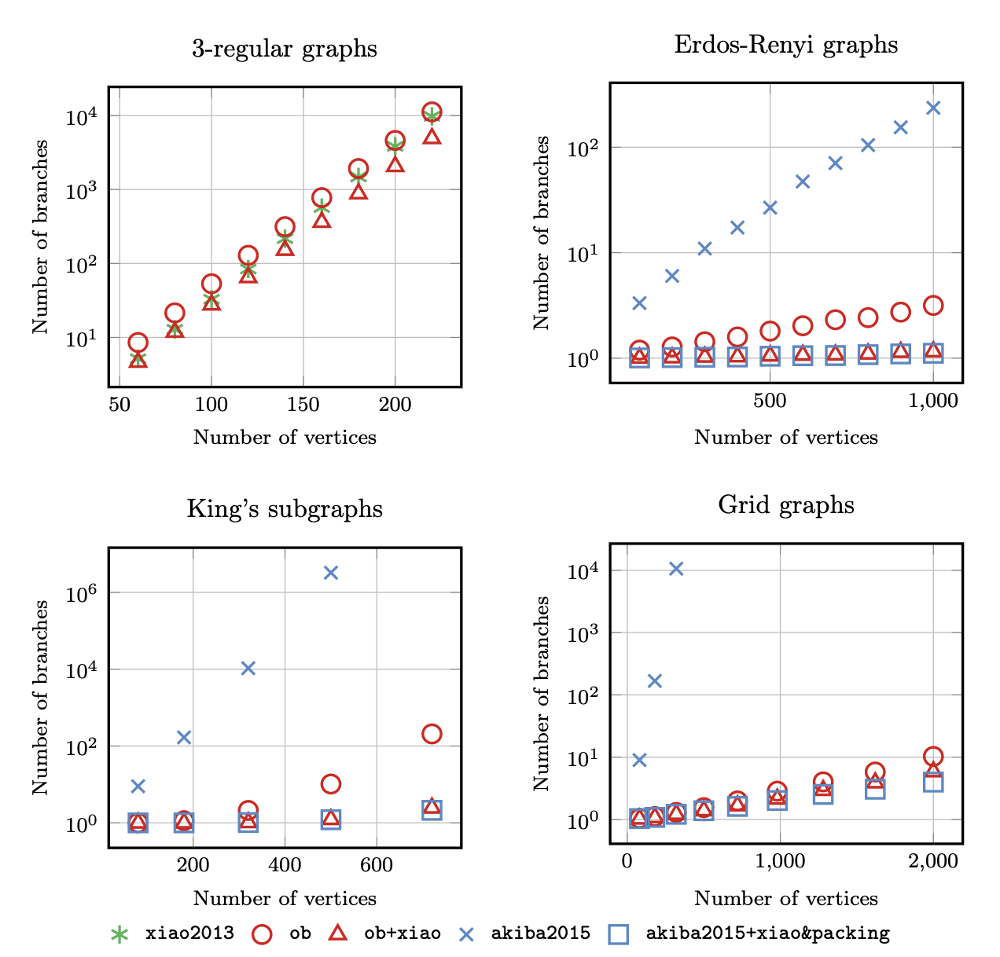
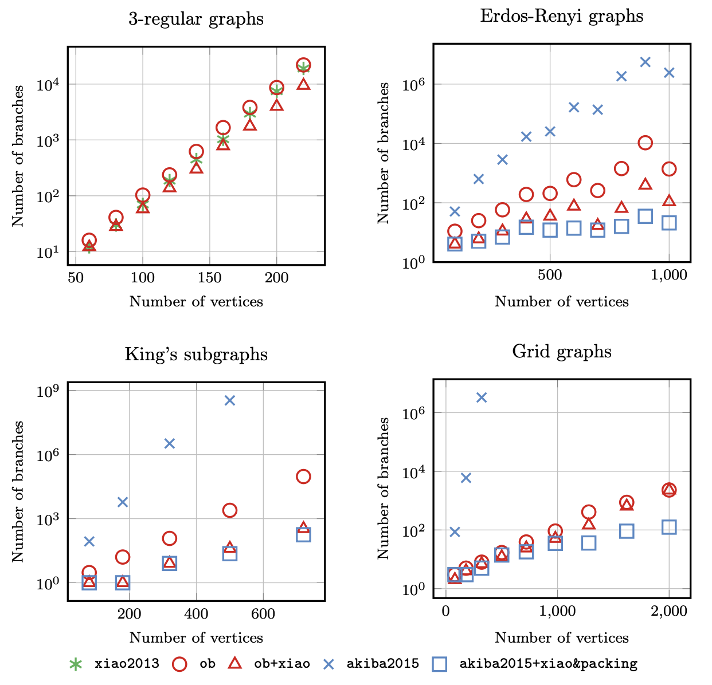

# Benchmarks

## The maximum independent set problem

We benchmarked the branch-and-reduce algorithm based on the optimal branching algorithm on the maximum independent set problem against various state-of-the-art solvers, where we compared the number of branches needed to solve the problem.

Our mehtod is denoted as $\texttt{ob}$ and $\texttt{ob+xiao}$, and the previous method include [$\texttt{xiao2013}$](https://doi.org/10.1016/j.tcs.2012.09.022) and [$\texttt{akiba2015}$](https://doi.org/10.1016/j.tcs.2015.09.023).
We compared the performance of these methods in 3-regular graphs, Erdős–Rényi random graphs, grid graphs and King's sub-graphs, for each size we generated 1000 random graphs.

The average number of branches needed to solve the problem is shown in the following figure:

The maximum number of branches needed to solve the problem among 1000 graphs is shown in the following figure:

These numerical results show that our method is competitive with the previous methods with less human-designed rules.